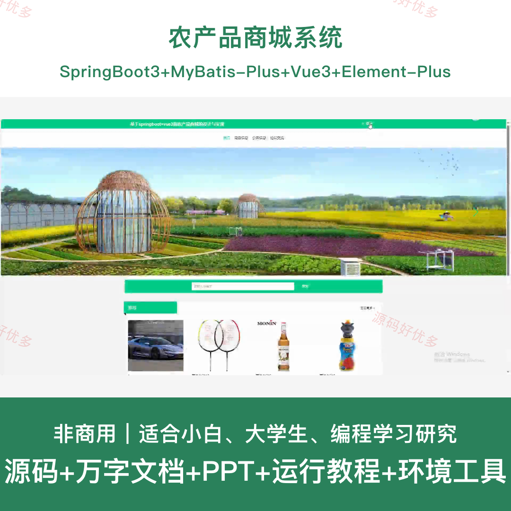
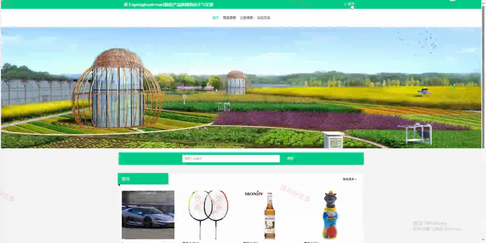
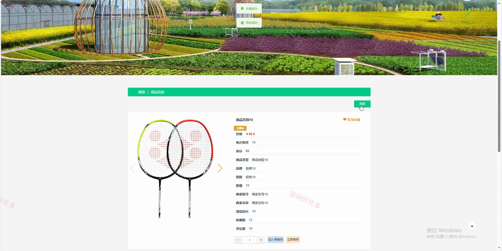
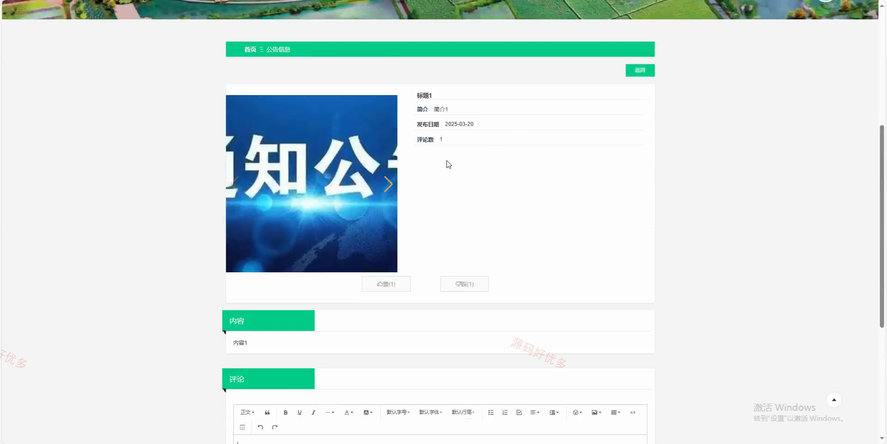
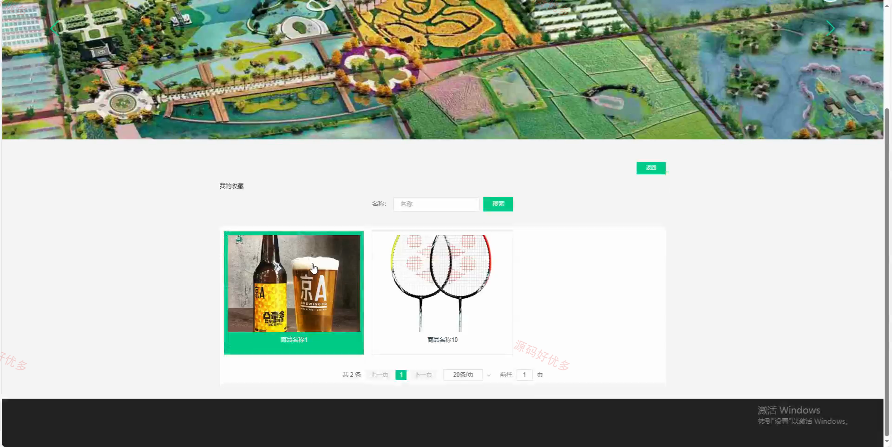
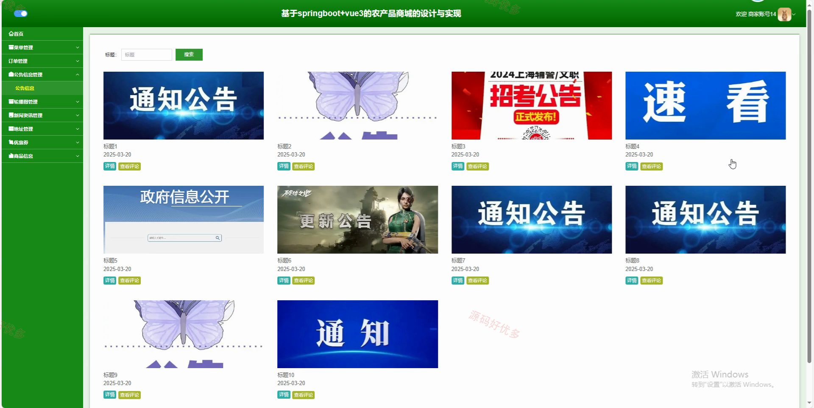
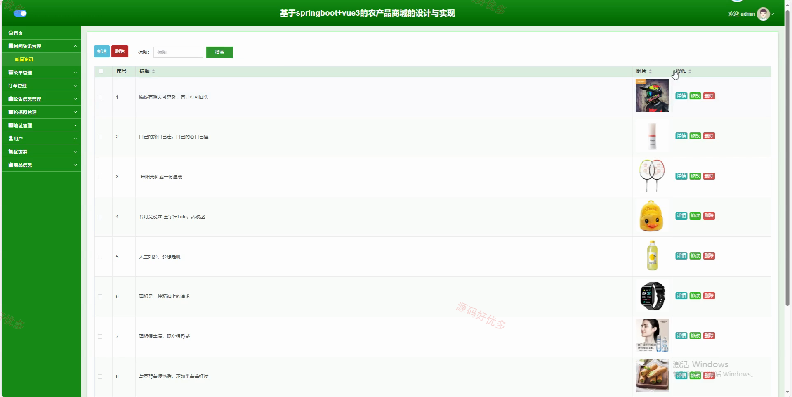
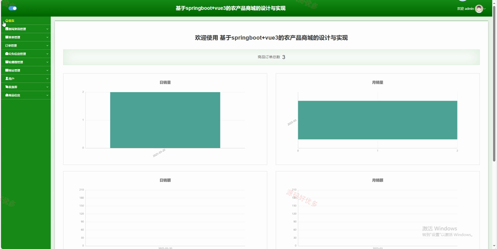
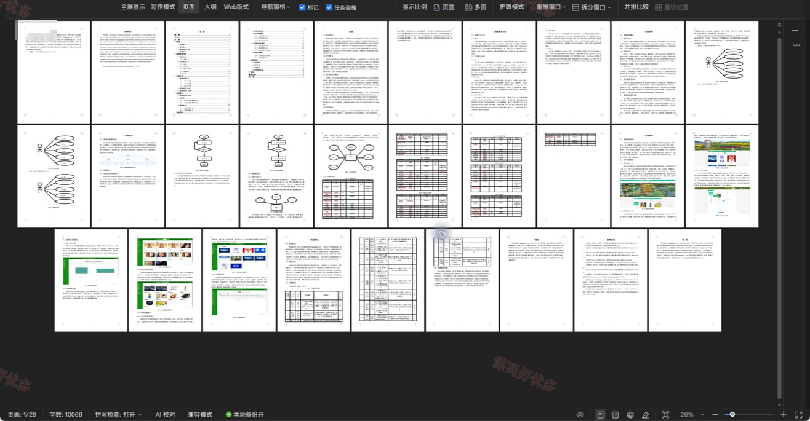

## 源码问题查看主页咨询

### 一、关键词
农产品商城系统、农产品商城、农产品商城订单管理、农产品商城在线交易

### 二、作品包含
源码+数据库+万字设计文档+PPT+全套环境和工具资源+本地部署教程

### 三、项目技术
前端技术： Html、Css、Js、Vue3.2、Element-Plus
后端技术：Java、SpringBoot3.3.0、MyBatis-Plus

### 四、运行环境（以下版本亲测，其他版本兼容性请自行测试）
开发工具：IDEA/eclipse + VSCODE

数据库：MySQL8.0+（共19张表）

数据库管理工具：Navicat10以上版本

环境配置软件： JDK17 + Maven3.6.3

前端Nodejs：16+

浏览器：谷歌浏览器

### 五、项目介绍
项目编号：springbootA601D

农产品商城系统面向管理员、用户、商家，提供新闻资讯管理、订单管理、公告信息管理、轮播图管理、地址管理、用户、优惠劵等功能，实现各角色在系统中的实际业务协作。

角色：管理员、用户、商家

管理员功能：后台账号登录、订单与发货管理、农产品及分类管理、用户与商家管理、优惠券管理、公告与新闻管理、轮播图与地址管理、运营数据统计。

用户功能：账号注册与登录、农产品浏览与评论、购物车与下单、订单查询与确认收货、收货地址管理、优惠券领取、农产品收藏、公告及论坛互动。

商家功能：账号注册与登录、农产品与分类维护、订单履约与物流、退款订单处理、公告与新闻查看、轮播图与公告互动、优惠券管理、收货地址管理。

### 六、运行截图

